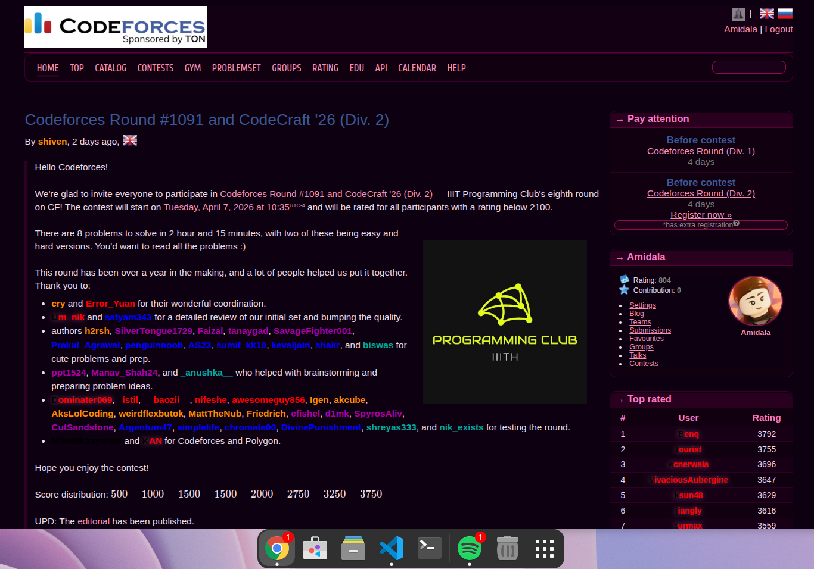

# Codeforces Dark Pink 🌸

A dark pink theme for Codeforces. [**Click to install**](https://github.com/Amiddala/codeforces-dark-pink/raw/main/codeforces-dark-pink.user.js) (requires a userscript manager)

  

---

## Download instructions

1. Install [Tampermonkey](https://www.tampermonkey.net/) for your browser.
2. [**Click this link to install**](https://github.com/Amiddala/codeforces-dark-pink/raw/main/codeforces-dark-pink.user.js).

Tampermonkey will open a window asking you to confirm the installation — just click **Install**.

> If you see this warning:
> **"Apps, extensions, and user scripts can not be added from this website."**
> You can safely ignore it and proceed. The full source code is public and open to review right here on GitHub.

---

## Features

-  Deep dark background — no whites
-  Pink accent colors throughout the UI
-  Styled tables, menus, forms, buttons, and popups
-  Custom scrollbars and text selection colors
-  Dark Monokai theme for the code editor
-  Adjusted user rank colors for better contrast on dark backgrounds

---

## Inspiration

Inspired by the Codeforces dark theme by [Gaurang Tandon](https://github.com/GaurangTandon/codeforces-darktheme). 
I kept the original idea and styling approach, but customized the colors into a pink theme to give it a softer and more personal touch.
